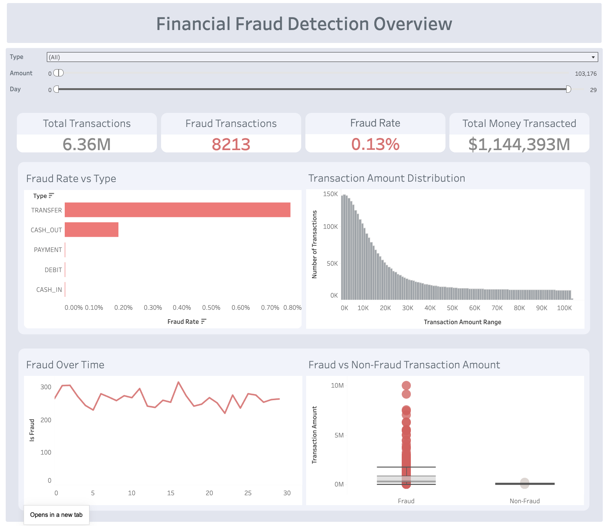

# Financial Fraud Detection & Transaction Pattern Analysis

---

## Dashboard Preview

  

---

## 🎯 Business Objective

Financial fraud poses a significant risk in modern digital payment ecosystems.  
The objective of this project is to analyze large-scale transaction data and uncover behavioral patterns associated with fraudulent activities.

Through a combination of **SQL-based data exploration**, **Python-driven exploratory analysis**, and **interactive Tableau visualizations**, this project demonstrates how data analytics can be leveraged to:

- Identify transaction characteristics linked to fraudulent behavior  
- Detect unusual balance changes and high-risk transaction patterns  
- Support the development of data-driven fraud monitoring systems

Ultimately, the goal is to illustrate how analytical insights can assist financial institutions in **detecting, monitoring, and mitigating fraudulent transactions more effectively**.

---

## 📊 Project Overview

Financial fraud is a growing concern in digital payment systems.  
The goal of this project is to analyze financial transaction data and identify patterns that distinguish fraudulent transactions from legitimate ones.

Using **SQL, Python, and Tableau**, this project explores transaction behavior, identifies suspicious patterns, and builds an interactive dashboard that helps visualize fraud trends and risk indicators.

The analysis focuses on answering questions such as:

- Which transaction types are most associated with fraud?
- Are fraudulent transactions typically larger in amount?
- Do balance changes reveal suspicious patterns?
- How can these insights help monitor fraud in real time?

---

## 🛠 Tools & Technologies

- **SQL** – Data exploration and fraud metrics  
- **Python (Pandas, Matplotlib, Seaborn)** – Exploratory data analysis and visualization  
- **Tableau** – Interactive dashboard and business insights  
- **GitHub** – Project version control and documentation  

---

## 📁 Dataset

The dataset contains simulated financial transaction records commonly used for fraud detection analysis.

Dataset Source:  
[PaySim Financial Dataset](https://www.kaggle.com/datasets/ealaxi/paysim1/data)

### Key Variables

| Column | Description |
|------|------|
| step | Time step of the transaction |
| type | Type of transaction (TRANSFER, CASH_OUT, PAYMENT, etc.) |
| amount | Transaction amount |
| oldbalanceOrg | Sender balance before transaction |
| newbalanceOrig | Sender balance after transaction |
| oldbalanceDest | Receiver balance before transaction |
| newbalanceDest | Receiver balance after transaction |
| isFraud | Fraud label (1 = Fraud, 0 = Legitimate) |
| isFlaggedFraud | Transactions flagged as suspicious by system |

---

## 🧮 SQL Analysis

SQL was used to perform **data exploration and fraud-related metric calculations**.

Key analysis performed using SQL:

- Total transactions and fraud rate
- Fraud occurrences by transaction type
- Fraud transaction amount statistics
- Balance change patterns in fraudulent transactions
- Flagged fraud transactions

These queries helped identify the **primary characteristics of fraudulent transactions** before moving into deeper analysis.

SQL queries used in this project can be found in:
fraud_analysis.sql

---

## 🐍 Python Exploratory Data Analysis

Python was used to explore the dataset further and visualize patterns that could indicate fraudulent behavior.

Key visualizations included:

- Fraud vs Non-Fraud transaction distribution
- Transaction amount distributions
- Fraud frequency by transaction type
- Balance changes in fraudulent transactions
- Correlation analysis between transaction features

These plots helped highlight abnormal transaction patterns that may indicate fraud risk.

---

## 📈 Tableau Dashboard

The final insights from SQL and Python analysis were integrated into an **interactive Tableau dashboard**.

The dashboard allows users to explore:

- Total transactions vs fraudulent transactions
- Fraud distribution across transaction types
- Transaction amount patterns
- Fraud indicators based on balance changes
- Suspicious transaction behavior

The interactive dashboard helps analysts quickly identify unusual transaction patterns and potential fraud risks.

---

## 🔍 Key Insights

The analysis revealed several interesting fraud patterns:

### 1️⃣ Fraud is concentrated in specific transaction types

Fraudulent activity occurs primarily in **TRANSFER** and **CASH_OUT** transactions, while other transaction types show almost no fraud cases.

### 2️⃣ Fraudulent transactions often involve unusually large amounts

Fraud transactions tend to cluster around **higher transaction values**, making transaction amount a strong indicator of suspicious activity.

### 3️⃣ Suspicious balance behavior

In many fraudulent transactions:

- Sender balances drop sharply  
- Receiver balances do not update normally  
- Some destination balances remain unchanged  

These patterns suggest **system manipulation or abnormal transaction flow**.

### 4️⃣ Fraud transactions represent a very small percentage of total transactions

Although rare, their financial impact can be significant, highlighting the need for **real-time fraud monitoring systems**.

---

## 📂 Project Structure

---

## 🚀 Future Improvements

Potential next steps for this project include:

- Building a **machine learning model for fraud prediction**
- Implementing **real-time fraud detection systems**
- Applying **anomaly detection algorithms**
- Developing a **fraud risk scoring system**

---

## 📌 Conclusion

This project demonstrates how **data analysis techniques can be used to uncover fraud patterns in financial transactions**.

By combining **SQL for structured analysis, Python for exploratory data analysis, and Tableau for visualization**, the project highlights how multiple analytical tools can work together to generate meaningful insights and support fraud monitoring.
